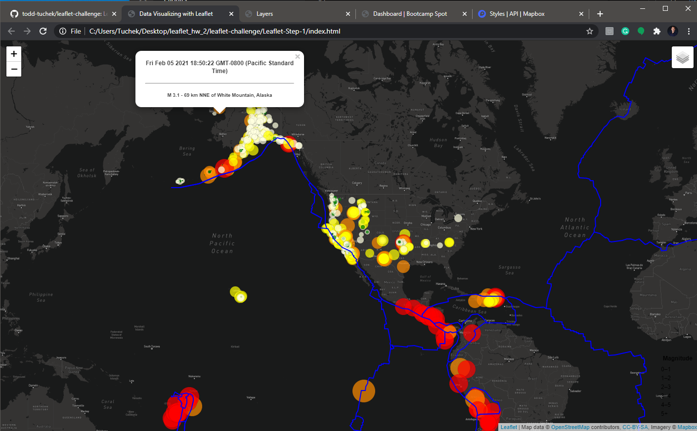
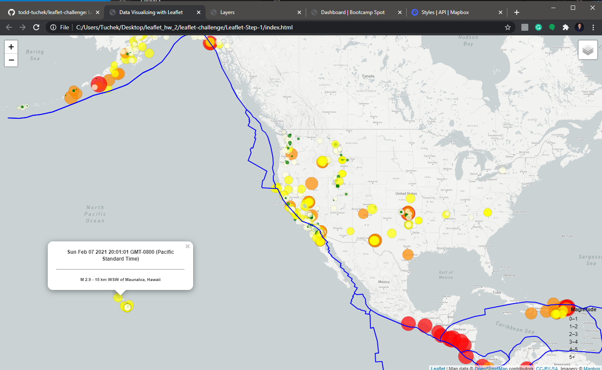
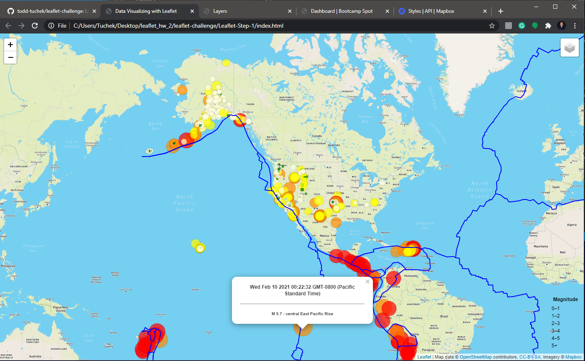
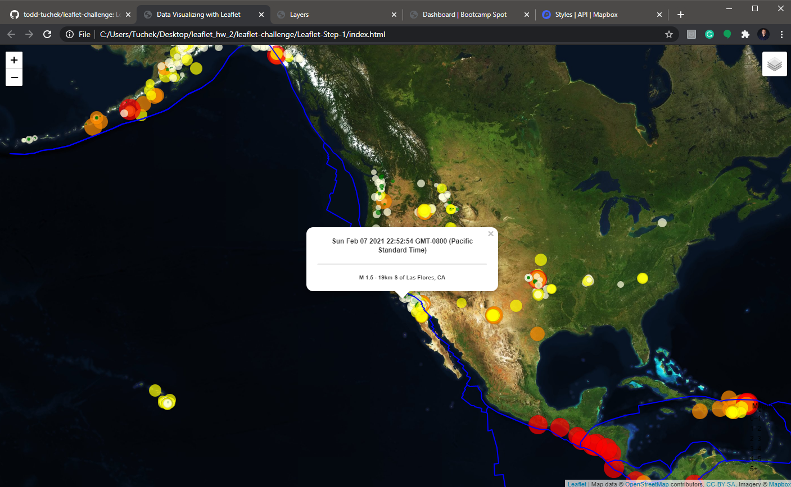
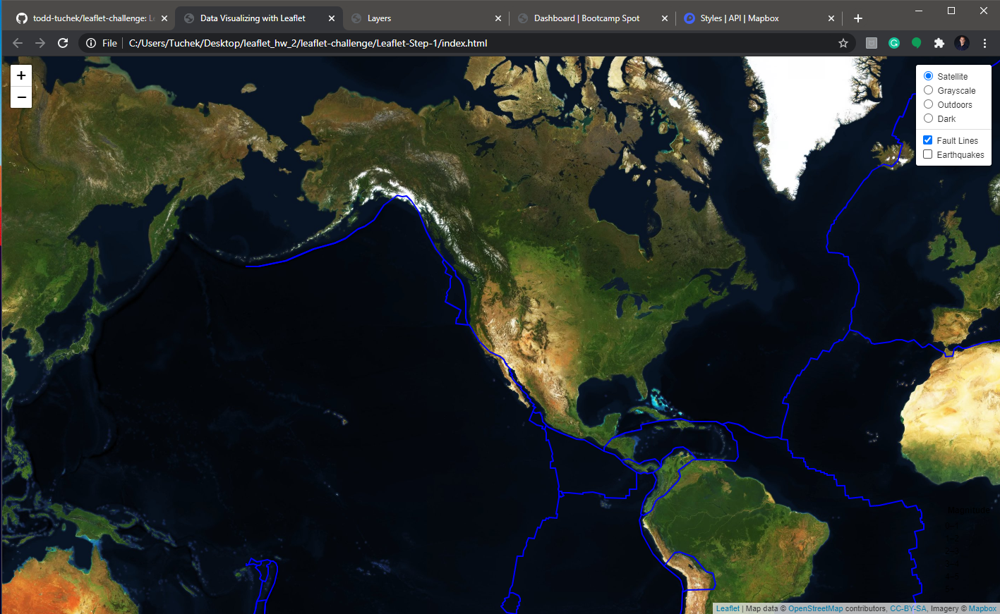

# leaflet-challenge
Leaflet Homework - Visualizing Data with Leaflet

<b>Project Details:</b>

An interactive map that shows earthquakes within the last week. 
Users can toggle between different map selections, while also clicking into each data point to see the:
- Date/time
- Earthquake magnitude 
- Location 

